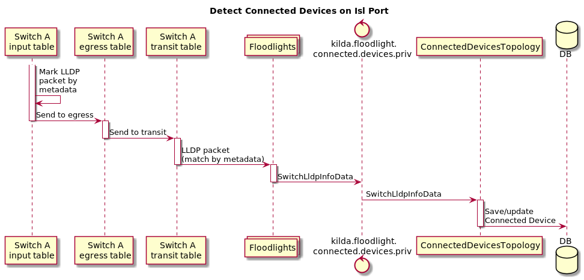

# Switch connected devices via LLDP 

## Summary

This feature allows to detect devices connected to particular switch
by catching LLDP packets. Design of the feature is based on multi-table feature design.

## API

New boolean field `detect_connected_devices_lldp` will be added to switch properties.
After setting it to `true` by API `PUT /{switch-id}/properties` several rules will be installed on the switch.
Description of these rules you can find in section `Detecting of connected devices via LLDP `.

New API will be created to get a list of devices connected to Switch: `GET /{switch_id}/devices?since={time}`

`flow_id` - Switch ID
`since` - Optional param. If specified only devices which were seen since this time will be returned.

This API returns following body:

~~~
{
  "ports": [
      {
         "port_number": int,
         "lldp": [{
            "vlan": int,
            "macAddress": string,
            "chassisId": string,
            "portId": string,
            "ttl": int,
            "portDescription": string,
            "systemName": string,
            "systemDescription": string,
            "systemCapabilities": string,
            "managementAddress": string,
            "timeFirstSeen": string,
            "timeLastSeen": string
           },
           ***
         ],
      },
      ***
   ]
}

~~~

The following fields are optional:

* portDescription
* systemName
* systemDescription
* systemCapabilities
* managementAddress

## Detecting of connected devices via LLDP 

To detect connected devices via LLDP we will catch LLDP packets from each switch port
and send them to controller to analyze it in Connected Devices Storm Topology.

There are two types of switch ports: customer and ISL. Rules will be different for each port type.

Full description of new rules you can find in
[this](https://drive.google.com/file/d/1yUUeLZ4lO85rzn2DwFHhVhG5arT6yhds/view?usp=sharing) doc.

Short description:

